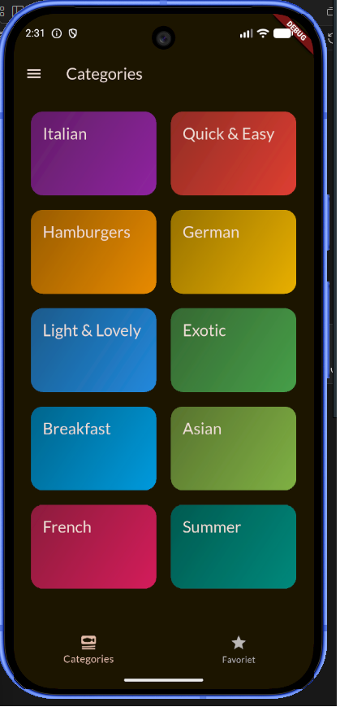
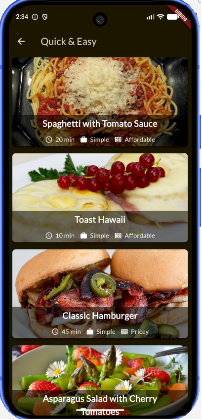
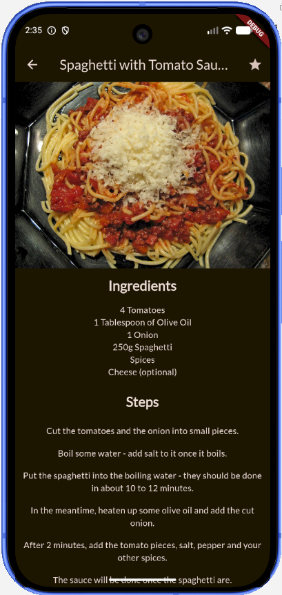
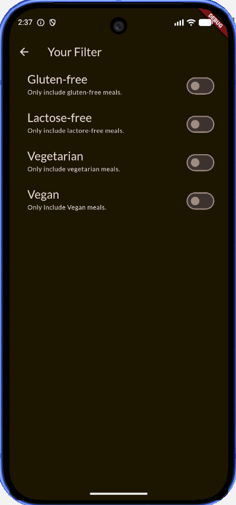

# 🍽️ Flutter Meals App (Learning Project)

## 📌 Overview
Project ini merupakan hasil pembelajaran Flutter dari course Udemy.  
Aplikasi ini menampilkan daftar makanan berdasarkan kategori, lengkap dengan detail makanan serta fitur filter.

Tujuan utama dari project ini adalah untuk memahami konsep dasar Flutter seperti:
- Widget & Layout
- Navigation (Screen & Routing)
- State Management sederhana
- Structuring project (models, screens, widgets)
- Theming & styling

---
## 📸 Screenshots
<p align="center">
  
  
  
  
</p>
## 🚀 Features

### 🗂️ Categories
- Menampilkan daftar kategori makanan dalam bentuk grid
- Setiap kategori bisa dipilih untuk melihat daftar makanan

### 🍔 Meals List
- Menampilkan daftar makanan berdasarkan kategori
- Data diambil dari `dummy_data.dart`

### 📄 Meal Detail
- Menampilkan detail makanan:
  - Gambar
  - Ingredients
  - Steps

### ⚙️ Filters
- Filter makanan berdasarkan preferensi:
  - Gluten-free
  - Lactose-free
  - Vegetarian
  - Vegan

### 📑 Navigation
- Menggunakan:
  - Navigator
  - Tabs
  - Drawer

---

## 🏗️ Project Structure

```
lib/
│
├── data/
│   └── dummy_data.dart
│
├── models/
│   ├── category.dart
│   └── meal.dart
│
├── screens/
│   ├── categories.dart
│   ├── meals.dart
│   ├── meal_details.dart
│   ├── filters.dart
│   └── tabs.dart
│
├── widgets/
│   ├── category_grid_item.dart
│   ├── meal_item.dart
│   ├── meal_item_trait.dart
│   └── main_drawer.dart
│
└── main.dart
```

---

## 🎨 UI & Theme
- Menggunakan Material 3
- Custom theme dengan ColorScheme.fromSeed
- Google Fonts (Lato)

---

## 🧠 Key Learnings

### 1. Widget Composition
- Membuat UI dari kombinasi widget kecil
- Reusable widget

### 2. Navigation
- Navigator.push()
- Tabs navigation

### 3. State Management (Basic)
- Mengelola state filter

---

## 🧠 State Management dengan Provider Riverpod

Dalam proyek ini, kita belajar menggunakan Provider Riverpod untuk mengelola state aplikasi secara lebih advanced. Riverpod adalah library state management yang modern dan powerful untuk Flutter.

### Konsep Utama yang Dipelajari:
- **Provider**: Container untuk state yang dapat diakses dari berbagai widget
- **StateNotifier**: Class untuk mengelola state dan logika bisnis
- **Consumer & ConsumerWidget**: Widget yang secara otomatis mendengarkan perubahan state
- **Scoped Providers**: Membatasi scope provider ke bagian tertentu dari widget tree

### Implementasi di Proyek:
- `MealsProvider`: Mengelola daftar makanan, filter, dan pencarian
- `FavoritesProvider`: Mengelola daftar makanan favorit pengguna
- `FiltersProvider`: Mengelola preferensi filter (gluten-free, lactose-free, dll.)

### Keuntungan Menggunakan Riverpod:
- **Type-safe**: Mengurangi error runtime dengan type checking
- **Testable**: Mudah untuk unit testing providers
- **Dependency Injection**: Inject dependencies dengan mudah
- **Performance**: Optimasi rebuild hanya pada widget yang perlu
- **Developer Experience**: Hot reload support dan debugging tools

---
- Mengirim data antar screen

### 4. Data Modeling
- Menggunakan class model

### 5. Folder Structure
- Memisahkan models, screens, widgets, dan data

---

## 📸 Screenshots
(Tambahkan screenshot di sini)

---

## 🛠️ Tech Stack
- Flutter
- Dart
- Google Fonts

---

## 🎯 Purpose
Project ini dibuat untuk pembelajaran Flutter dasar.

---

## 💡 Next Improvement
- Integrasi API
- State management (Provider/Riverpod)
- Dark mode
- Favorite feature


import 'package:flutter_riverpod/legacy.dart';